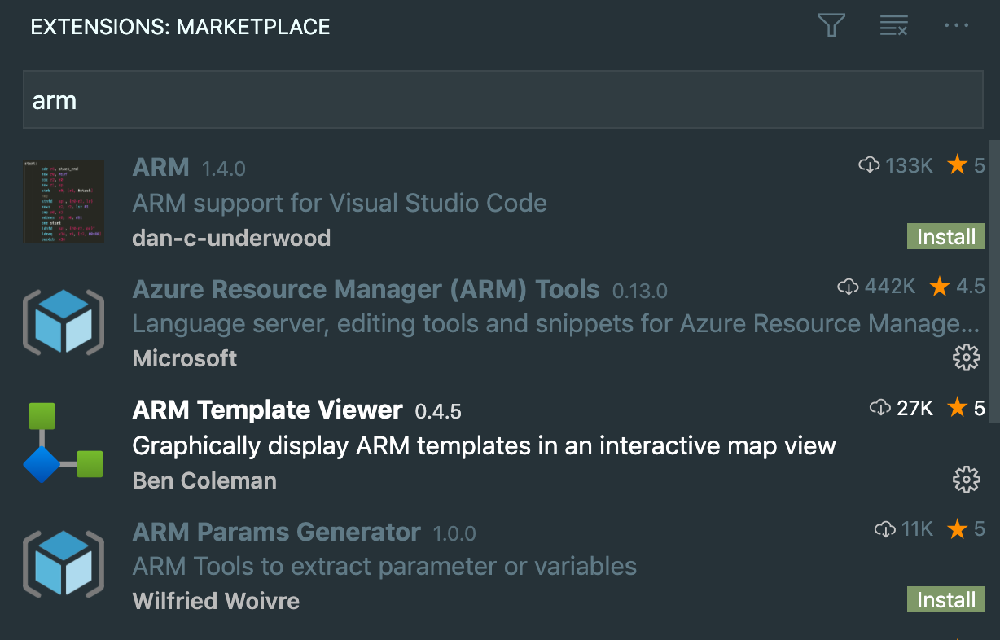

# demo repo for one-click Azure ARM deployment

use direct link + `encodeURIComponent`

Other ways to deploy: https://docs.microsoft.com/en-us/azure/azure-resource-manager/templates/deploy-to-azure-button

VS Code extensions for arm:

